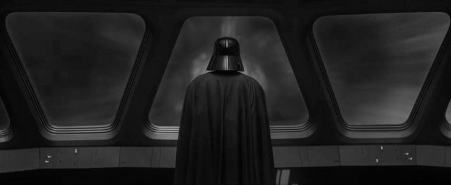

<div align="center">

</div>

<br/>

<div align="center">

</div>

<br/>

---

**`> whoami`**

```
name     :  Yasmin Carvalho
age      :  20
role     :  padawan → software engineer
course   :  engenharia de software — 3º sem
college  :  unicesumar, londrina / pr
status   :  [████████░░] compiling...
```

Estudo engenharia de software com foco em entender
como sistemas funcionam por dentro. Gosto de estrutura,
lógica e de transformar aprendizado em código funcional.

Seja bem-vindo ao meu GitHub.

---

<div align="center">

</div>

<br/>

---

**`> stack`**

<div align="center">


</div>

---

**`> projects`**

> *"Do. Or do not. There is no try."*

| project | description | status |
|---------|-------------|--------|
| `coming soon` | missão ainda classificada | `[ building ]` |
| `coming soon` | explorando novas rotas | `[ planning ]` |

---

**`> stats`**

<div align="center">

 


<br/>


</div>

---

**`> contact`**

<div align="center">

[](https://linkedin.com/in/yasmin-c-349b71285/) 
[](https://github.com/Yaswsxz) 
[](mailto:yasmincarvalho06@icloud.com)

</div>

---

<div align="center">

<br/><br/>
<sub><code>// she started coding. the force was strong.</code></sub>
</div>
